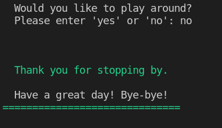
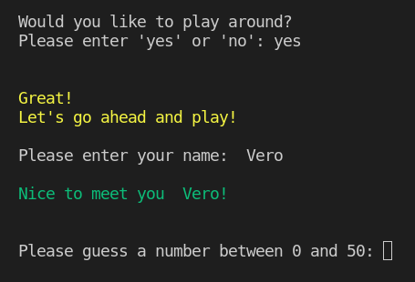
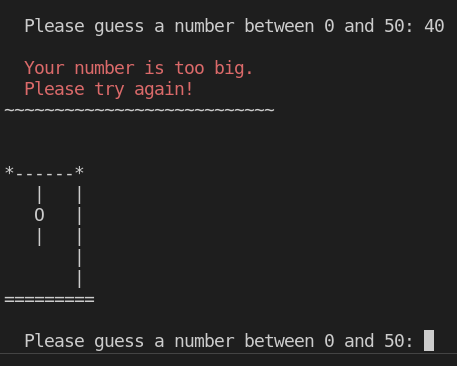
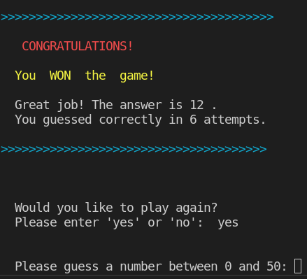
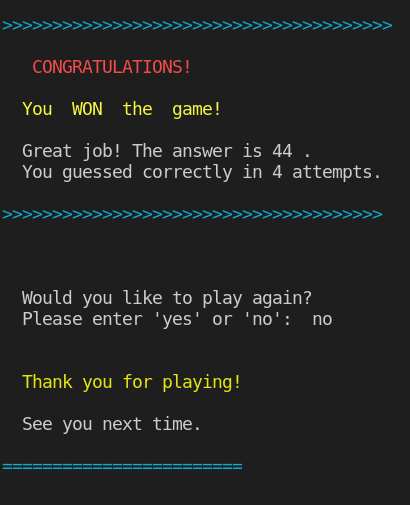
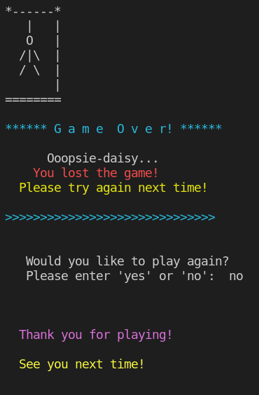
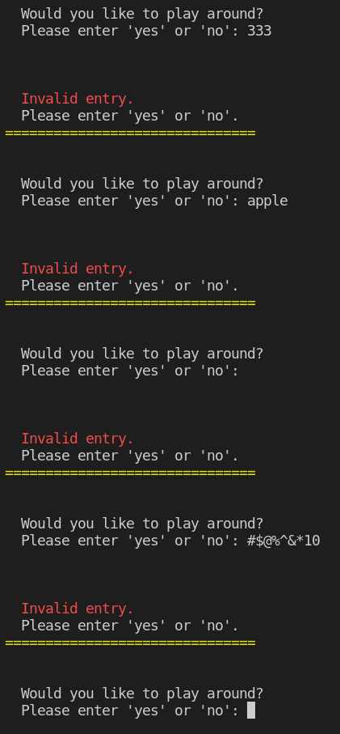
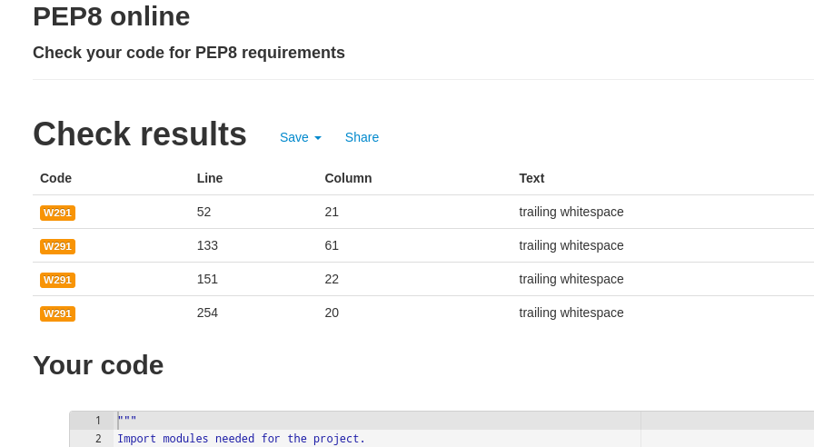
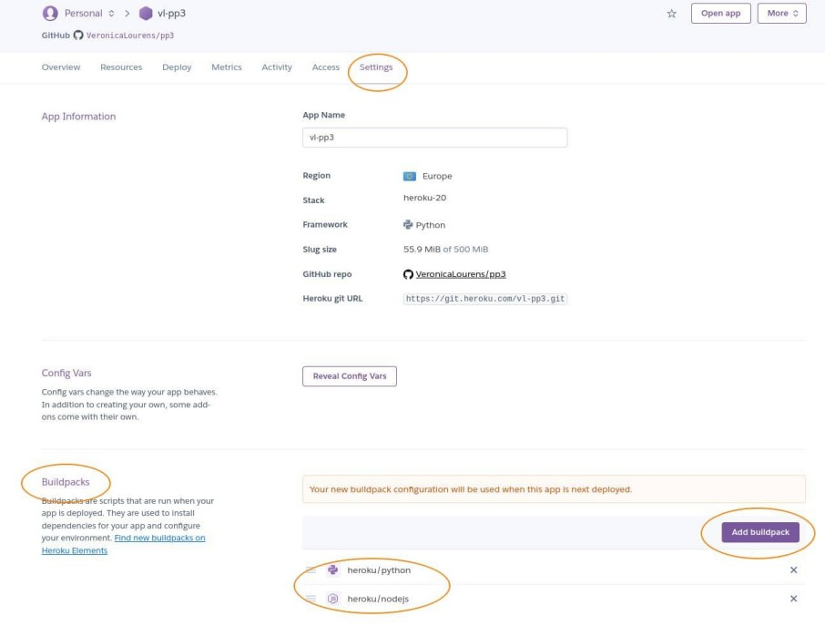

# Hangman Game

## Game Overview

Hangman game is a simple guessing game that runs in Python. User guesses a number each time. There is a hint that tells the user if the number guessed is too big or too small from the target. The user keeps guessing until guesses a correct number or until reaches the maximum attempts allowed.

Click here to view the live site [Hangman Game](https://vl-pp3.herokuapp.com/)


Table of Contents
  - [How To Play](#how-to-play)
  - [User Experience UX](#user-experience-ux)
    - [User Stories](#user-stories)
    - [Site Owner Stories](#site-owner-stories)
  - [Existing Features](#existing-features)
    - [Start Screen](#start-screen)
    - [Exit Screen](#exit-screen)
    - [Greet User Screen](#greet-user-screen)
    - [Invalid Data Screen](#invalid-data-screen)
    - [Play Game Screen](#play-game-screen)
    - [Winning Game Screen](#winning-game-screen)
    - [Lost Game Screen](#lost-game-screen)
  - [Technologies Used](#technologies-used)
  - [Testing](#testing)
    - [PEP8 online code validation](#pep8-online-code-validation)
    - [Input Testing](#input-testing)
    - [Terminal Testing](#terminal-testing)
    - [Testing User Stories](#testing-user-stories)
    - [Resolved Bug](#resolved-bug)
  - [Libraries](#libraries)
    - [Random](#random)
    - [Colorama](#colorama)
  - [Deployment](#deployment)
    - [Deploy the project to Heroku](#deploy-the-project-to-heroku)
  - [Credit](#credit)
  - [Acknowledgement](#acknowledgement)


## How To Play

* The Hangman game is to guess a random number chosen by the computer. There is a welcoming message and the game info on the start screen. It asks user to decide if user would like to play or not. If the answer is ‘no’, then the program exits. Otherwise, the game starts.

* It asks user’s name, then displays a greeting message to the user. Following it gives user a hint about guessing a number from the range of number between 0 and 50. 

* User gets a message when the answer is incorrect. It gives user a hint that the number guessed is either too small or too big from the target number. Meanwhile, it prints out one part of the Hangman body graphics on each wrong answer. User keeps guessing the number until the answer is correct or reaches the maximum attempts allowed.

* User gets a winning message of congratulations if user guesses the correct number. It also tells user what the answer is and how many attempts user guessed. User gets a lost message of telling user that the game is over. Meanwhile, it prints out the full graphics of the Hangman.

* It asks user if user would like to play again after both win or lost the game. If user’s answer is ‘no’, then the program exits. If user’s answer is ‘yes’, then user can continue playing the game.

[Back to top](#hangman-game)


## User Experience UX

 ### User Stories

 * As a first time user, I want the game to be easily accessible.
 * As a first time user, I want to know how to play the game.
 * As a game user, I want to know the game result.
 * As a game user, I want to be able to continuesly play the game as I wish.

[Back to top](#hangman-game)


 ### Site Owner Stories

 The purpose of the site is to provide an easy and fun guessing game for everyone to enjoy.

## Existing Features

The game is built using Python and runs in Heroku. The Hangman game is to guess a random number chosen by the computer between 0 and 50. User has maximum 7 attempts to guess.

### Start Screen
  It displays a welcoming message, a human graphic, game info on the start screen. It asks user to decide if user would like to play or not. 


[Back to top](#hangman-game)

### Exit Screen
The game exits if the user enters 'no' when deciding not to play the game.
  


[Back to top](#hangman-game)

### Greet User Screen
It asks for user's name afterwards if the user enters 'yes' and display a greeting message. Then it asks user to start guessing. It gives user hints about the range of numbers to be entered.




[Back to top](#hangman-game)

### Invalid Data Screen
It displays an invalid message if user enters neither 'yes' nor 'no'.


[Back to top](#hangman-game)

### Play Game Screen
It prints one piece of Hangman body graphics on each time user enters a wrong number that either the number is too big or too small.




[Back to top](#hangman-game)

### Winning Game Screen
* It displays a message of congratulatons if the user wins the game. and asks user if the user would like to play again or not. It the answer is 'yes', the game goes on.



[Back to top](#hangman-game)

* It displays a message of ```Thank you for playing!``` and ```See you next time``` if user enters 'no'.



[Back to top](#hangman-game)

### Lost Game Screen
* It displays a lost message if the user loses the game. It prints out the complete Hangman graphics. It asks user to play again or not. The game restarts if the answer is 'yes'. 


[Back to top](#hangman-game)

* The game exits if the answser is 'no'.




[Back to top](#hangman-game)

## Technologies Used

* [GitHub]() - to host the files and the content of the game.
* [GitPod]() - to edit the code and push the code to GitHub page.
* [Python]() - to create the code for the game's functionalities.
* [Am I Responsive]() - to generate the site's responsiveness preview image on the top of the README file.
* [Heroku]() - to deploy and run the Hangman game.
* [PEP8 online]() - to validate the Python code.

[Back to top](#hangman-game)

## Testing

### PEP8 online code validation

The code of the program is manually tested via [PEP8](http://pep8online.com/) and no errors found.


[Back to top](#hangman-game)

### Input Testing

I have tested the inputs during the project development. 

* It displays ```Invalid data``` and ```Please enter 'yes' or 'no' ``` when user enters something neither 'yes' nor 'no'.
  
  
  

* It displays ```Invalid data``` and ```Please enter a number!``` when user enters letters rather than the numbers where it requires to enter a number.

  


### Terminal Testing 

* I manually tested the program every time I wrote the functions during the project development in both the ***GitPod*** terminal and in the ***Code Institute*** terminal template in ***Heroku***. 

* The final program works well and confirms the error message when capturing invalid data. The game can be continuesly played without error.


[Back to top](#hangman-game)

### Testing User Stories

* As a first time user, I want the game to be easily accessible.
  
  * User is able to access the game easily on different media screens as the program   is responsive on different screen sizes.
* As a first time user, I want to know how to play the game.
  
  *  The Game Info on the start screen tells user to follow the prompts to guess a number. There are questions for user to answer following one to another. User is able to find out how the game works.
* As a game user, I want to know the game result.
  
  * There are different messages displayed based on the user’s answer each time user answers a question or enters a number. It prints out a part of the Hangman body parts each time user guesses a wrong number. Therefore, user is able to find out the result.
* As a game user, I want to be able to continuesly play the game as I wish.
  
  * The game restarts as long as user enters ‘yes’ whether user wins the game or loses the game. User is able to continue playing the game by guessing a number again. 


[Back to top](#hangman-game)


### Resolved Bug

There were warnings about trailing whitespace during the code validation on ```PEP8 online```. I got a great tip on the ```Slack``` community and delete the whitespace using the ```Backspace``` key.




[Back to top](#hangman-game)


## Libraries

  ### Random

  The ```random``` module was imported to generate a random interger between 0 and 50 using ```randint``` method.

  ### Colorama

  The```colorama``` module was imported to color the text for the project.

## Deployment

### Deploy the project to Heroku

  1. Log in to my personal Heroku account page, select ```Create new app```, give a name to the new app, choose a ```region``` from the drop down list to```Europe```. Then click ```Create app```.
  
  2. Go to the ```Settings``` tab afterwards, click ```Add buildpack``` button on the right side of the ```Buildpacks section```, first select ```python``` and add it, then select ```nodejs``` and add it.



[Back to top](#hangman-game)


  3. Go to the ```Deploy``` tab, click ```GitHub``` in the ```Deployment method``` section, search for the repo on GitHub, click ```Connect```. 
  4. In the ```Manual deploy```section, seclect ```main``` and then click ```Deploy Branch``` button, the app was successfully deployed after a while. 
  5. Click the ```View``` button on the bottom of the page or the ```Open app``` button on the top right corner to view the programme.


[Back to top](#hangman-game)

## Credit

* I watched Python tutorials by [Corey Schafer](https://www.youtube.com/watch?v=YYXdXT2l-Gg&list=PL-osiE80TeTt2d9bfVyTiXJA-UTHn6WwU) on [YouTube]() to learn more about Python.

* The Hangman graphics are from [Shaun Halverson](https://www.youtube.com/watch?v=pFvSb7cb_Us) on [YouTube]().
  
* I watched Python mini projects and how to import colorama module in Python by [Tech With Tim](https://www.youtube.com/watch?v=DLn3jOsNRVE&t=1515s) on [YouTube]() to gain the extra knowledge for building the Hangman game.

[Back to top](#hangman-game)

## Acknowledgement

* Whilst I have tried to deviate as much as possible, there might be some similarities in the code as the project was influenced by the code along Love Sandwiches project at [Code Institute]().

* I relied upon the support from Code Institue [online tutors](),  mentor [Precious Ijege](),  project lead [David Bowers](), Slack community and my families. Great thanks to all those who support my learning journey. 
  
* I use W3schools, YouTube and stack overflow for general references throughout the project. I watched the tutorial videos on Youtube to gain extra knowledge about Python.

* The [Hangman Game]() application is intended for education purpose of completing the Portfolio Project 3 for the Diploma of Full Stack Software Development course at [Code Institue](https://codeinstitute.net/).

[Back to top](#hangman-game)